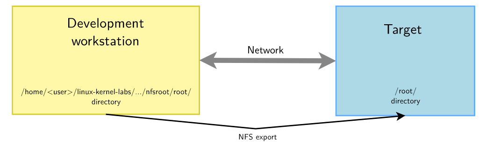

# Linux-Kernel-and-Driver-Development-Custom-Drivers
This repository contains the drivers for Nunchuk and USB-UART-Serial devices as kernel modules. 
This implementation follows the labwork of an open source training **'Linux kernel and driver development'** from Bootlin ([Linux kernel Slides.pdf](https://bootlin.com/doc/training/linux-kernel/linux-kernel-slides.pdf), [Linux kernel Labs.pdf](https://bootlin.com/doc/training/linux-kernel/linux-kernel-labs.pdf)).

The hardware used for this project is [BeagleboneBlack](http://beagleboard.org/black). This branch has the device drivers for,
 * A [Wii Nunchuk](https://www.olimex.com/Products/Modules/Sensors/MOD-WII/MOD-Wii-UEXT-NUNCHUCK/open-source-hardware) as an I2C device in the file [nunchuk.c](https://github.com/ranjithasubramaniam/Linux-Kernel-and-Driver-Development-Custom-Drivers/blob/master/nfsroot/root/nunchuk/nunchuk.c)
 * A UART USB device in the file [serial.c](https://github.com/ranjithasubramaniam/Linux-Kernel-and-Driver-Development-Custom-Drivers/blob/master/nfsroot/root/serial/serial.c)

The kernel configuration file for Nunchuk can be found in https://github.com/ranjithasubramaniam/Linux-Kernel-and-Driver-Development-Nunchuk-Kernel-Config/blob/nunchuk/arch/arm/boot/dts/am335x-customboneblack.dts

The kernel configuration file for serial device can be found in https://github.com/ranjithasubramaniam/Linux-Kernel-and-Driver-Development-Nunchuk-Kernel-Config/blob/nunchuk/arch/arm/boot/dts/am335x-customboneblack.dts

In order to facilitate continuous development of these device drivers, they are compiled as standalone (out-of-tree) kernel modules. The drivers are developed in the host system and deployed to the target system using NFS(Network File System) root filesystem. Once the developement is frozen, these device drivers will be moved to the respective aforementioned repositories as in-tree kernel modules. The following picture depicts the file access through NFS root filesystem (reference from [Linux kernel Labs.pdf](https://bootlin.com/doc/training/linux-kernel/linux-kernel-labs.pdf)).

  

                                     
